# Corporate Bankruptcy Risk Prediction with Machine Learning

This project predicts whether a US public-company observation is **failed** or **alive** from 18 financial-statement variables. It compares an accuracy-only majority baseline with interpretable Logistic Regression, regularized Logistic Regression, tree ensembles, threshold analysis, and a PCA extension. The emphasis is leakage-aware evaluation of the minority failed class—not a claim that one model can explain or cause bankruptcy.

## Research question

How well can financial statement variables identify failed company-year observations out of sample, and do flexible tree-based classifiers improve on an interpretable Logistic Regression benchmark?

## Why this matters in finance

Bankruptcy screening matters to lenders, investors, auditors, and risk teams because missed failures can be costly. It is also unusually difficult: failures are rare, accounting variables are correlated and heavy-tailed, firms appear in multiple years, and the costs of false negatives and false positives differ. A useful screening system therefore needs more than high overall accuracy; it needs an explicit trade-off between finding failed firms and limiting false alarms.

## Dataset

The American Companies Bankruptcy Prediction dataset contains **78,682 company-year observations**, **8,971 companies**, and years **1999–2018**. It has 18 predictors (`X1`–`X18`) covering assets, profitability, debt, revenue, liabilities, and expenses. The binary target is `failed = 1` for a failed observation and `failed = 0` for an alive observation.

Only **5,220 observations (6.63%)** are failed; 73,462 (93.37%) are alive. This imbalance makes plain accuracy misleading.

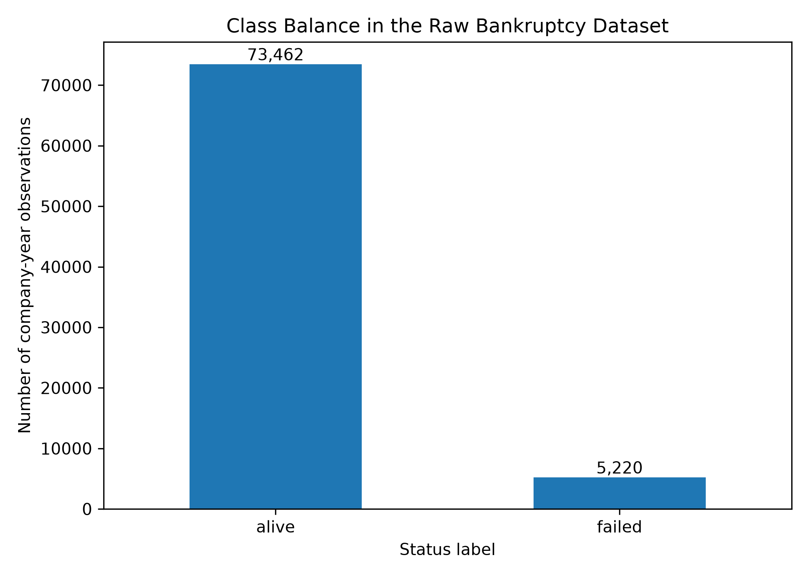

Failure rates also vary over time, which can reflect changing sample composition and economic conditions; the plot is descriptive, not causal.

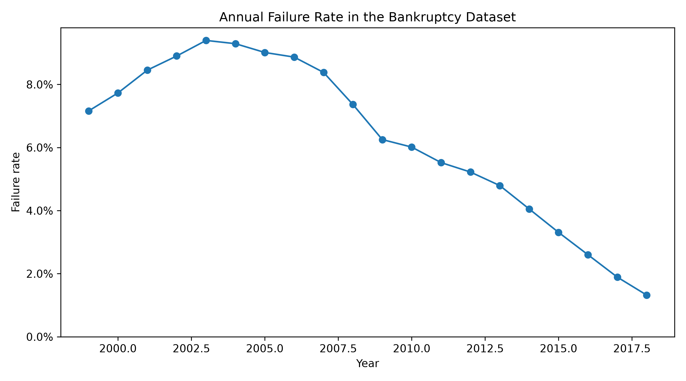

Median differences provide an initial financial view of the classes without implying that any variable causes failure.

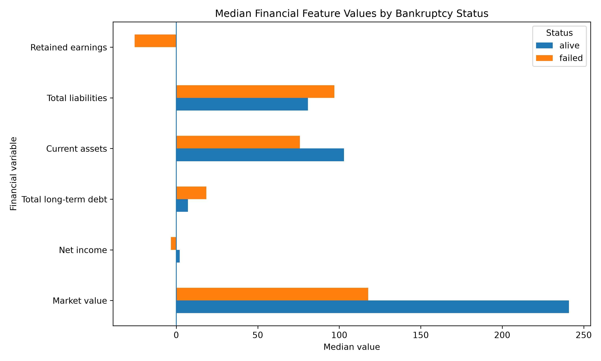

## Methodology

1. Validate the raw data, encode the target, and retain all 18 non-constant financial predictors.
2. Split at the **company level**: 80% of companies for training and 20% for the final test set. No company should occur in both sets.
3. Create a second company-level validation split inside the training data for hyperparameter selection and threshold analysis.
4. Select regularized and tree-model settings using validation PR-AUC; keep the final test set untouched during selection.
5. Evaluate all selected models once on the final test set using failed-class and ranking metrics.

Logistic and PCA pipelines standardize predictors. Class-weighted Logistic Regression and tree methods give the minority failure class more influence during fitting; Gradient Boosting uses balanced sample weights. This improves attention to failures but can increase false positives.

## Reproducible workflow

The repository uses Pixi for its environment, pytask for the dependency-based build, and pytest for verification. The pipeline produces cleaned data, fitted model artifacts, tables, and figures from the raw CSV. Randomized operations use a fixed seed (`42`).

## Models

- **Majority-class baseline:** always predicts alive; exposes the weakness of accuracy under imbalance.
- **Logistic Regression:** the main interpretable benchmark; coefficients describe conditional associations with failure log-odds.
- **L1 Logistic Regression:** can shrink some coefficients to zero and perform feature selection.
- **L2 Logistic Regression:** shrinks correlated coefficients without usually removing them.
- **Decision Tree:** captures nonlinear rules and interactions in a relatively readable structure.
- **Random Forest:** averages many trees to reduce variance and improve robustness.
- **Gradient Boosting:** builds trees sequentially to correct earlier errors.
- **PCA + Logistic Regression:** tests whether compressed, orthogonal combinations of correlated predictors preserve predictive information.

## Evaluation metrics

- **Accuracy:** share of all correct classifications. It is dominated by alive firms here.
- **Balanced accuracy:** average recall across the alive and failed classes.
- **ROC-AUC:** probability that a randomly selected failed observation receives a higher risk score than a randomly selected alive observation.
- **PR-AUC:** summarizes the precision–recall curve for failures and is especially informative when failures are rare. Its baseline is close to the failure prevalence.
- **Failed-class precision:** among observations flagged as failed, the share that truly failed.
- **Failed-class recall:** among true failures, the share detected.
- **Failed-class F1:** harmonic mean of failed-class precision and recall.

## Key results

The final test set contains 15,694 observations, including 1,177 failures (7.50%). Selected results at each classifier's default prediction rule are:

| Model | Accuracy | ROC-AUC | PR-AUC | Failed precision | Failed recall | Failed F1 |
|---|---:|---:|---:|---:|---:|---:|
| Majority baseline | 0.925 | 0.500 | 0.075 | 0.000 | 0.000 | 0.000 |
| Logistic Regression | 0.360 | 0.690 | 0.153 | 0.095 | 0.884 | 0.172 |
| Random Forest | 0.814 | **0.699** | **0.159** | **0.168** | 0.376 | **0.232** |
| Gradient Boosting | 0.679 | 0.688 | 0.158 | 0.132 | 0.590 | 0.216 |

The baseline's 92.5% accuracy hides complete failure to detect the positive class. Random Forest provides the strongest final-test PR-AUC and failed-class F1, while Gradient Boosting produces higher recall and the best balanced accuracy (0.638) among all evaluated models. Logistic Regression detects most failures but creates many false alarms. There is therefore no universal winner: the preferred model and threshold depend on the relative cost of missed failures versus unnecessary reviews. Differences are modest and should not be overinterpreted.

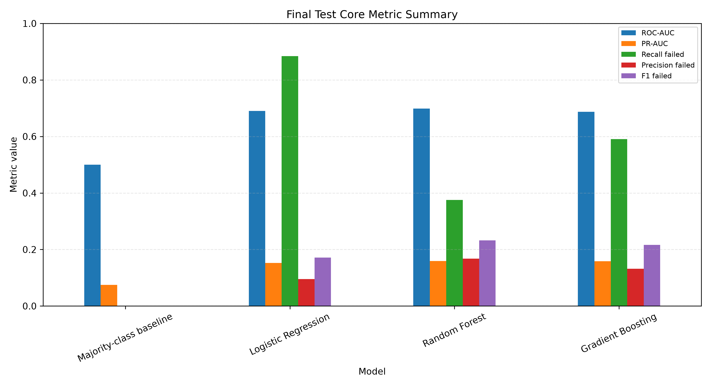

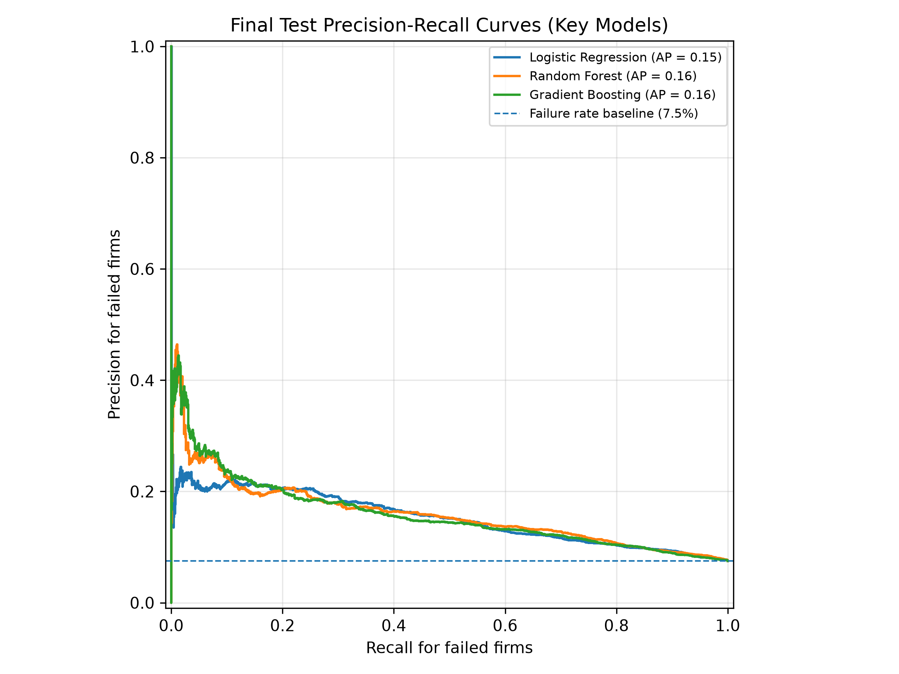

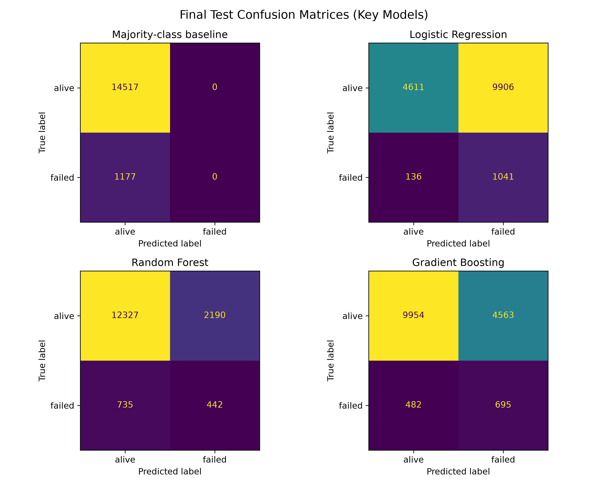

## Model interpretation

For standardized Logistic Regression inputs, current assets and market value have the largest negative coefficients, while total current liabilities has the largest positive coefficient. These are associations conditional on the other inputs and do not establish causal effects. Correlated financial levels can also make individual coefficient signs unstable or unintuitive.

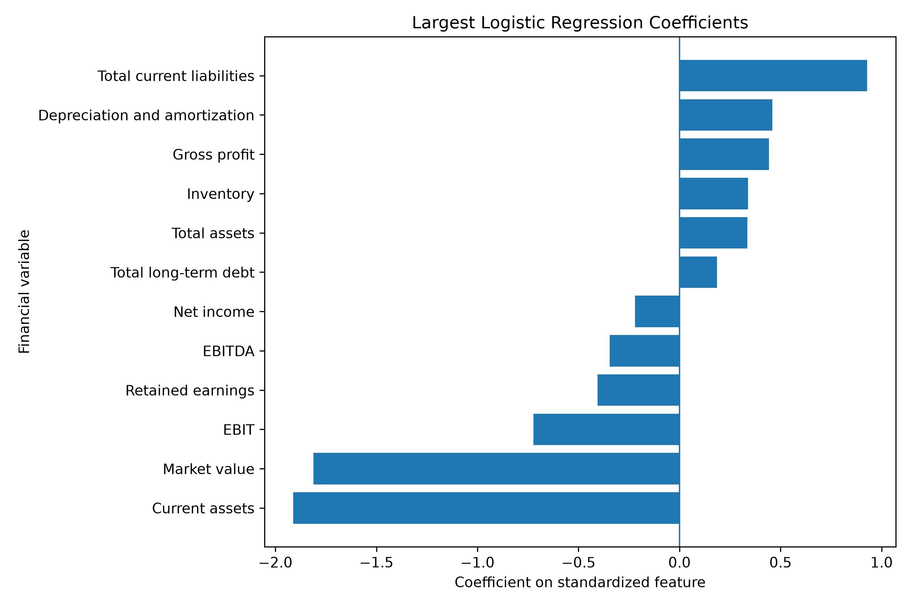

Across the tree models, market value, net income, and long-term debt rank prominently. Feature importance shows how much a fitted model used a variable for prediction; it does not give an effect direction or causal interpretation.

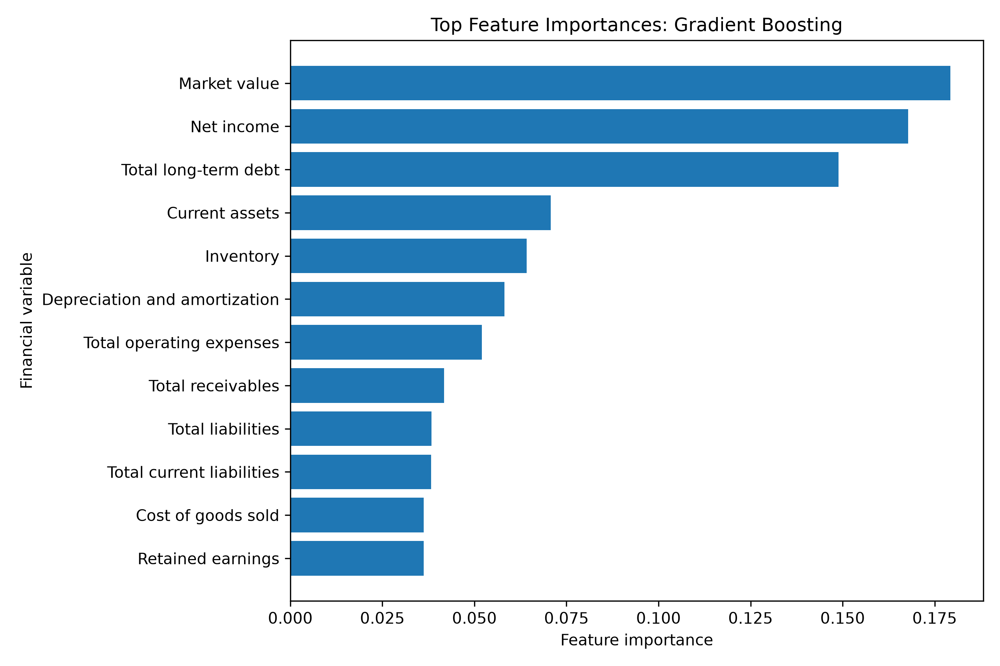

## Threshold tuning

The default 0.50 cutoff is not automatically appropriate for bankruptcy screening. Lower cutoffs usually find more failures but generate more false positives; higher cutoffs usually improve precision but miss more failures. Thresholds were explored on **validation predictions only**, never chosen on the final test set. For example, validation F1 was maximized at 0.53 for Logistic Regression, 0.57 for Random Forest, and 0.68 for Gradient Boosting. These are analytical candidates, not universal operating thresholds; deployment would require explicit costs, calibration checks, and fresh data.

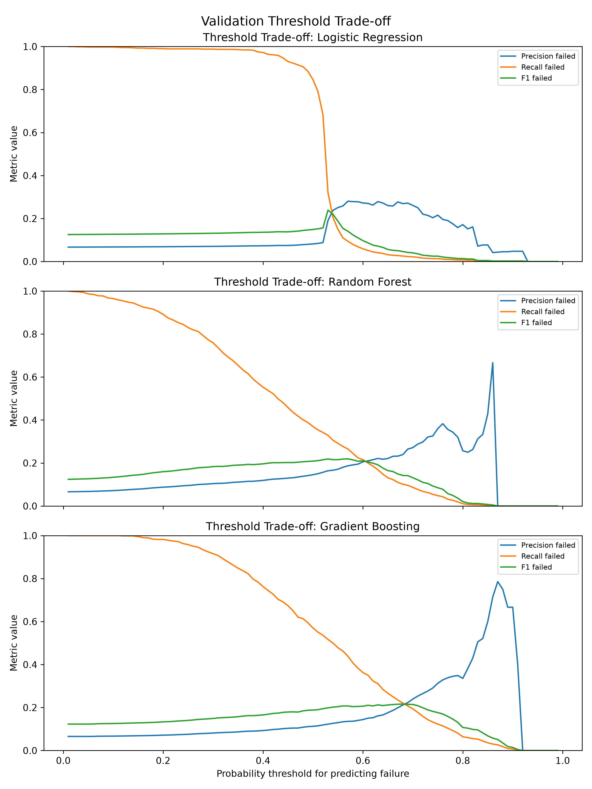

## PCA extension

PCA converts standardized, correlated financial predictors into orthogonal components. Two components explain 83.8% of validation-split variance, and ten explain 99.2%, but variance preservation is not the same as preserving class-separation information. The best PCA validation PR-AUC in the tested grid occurs with 12 components (0.151), only marginally above the non-PCA Logistic Regression validation result (0.148) and with less direct financial interpretability. More generally, PCA performance improves as more components are retained and does not provide a clear reason to replace the original-feature benchmark. PCA results are internal-validation results, not final-test claims.

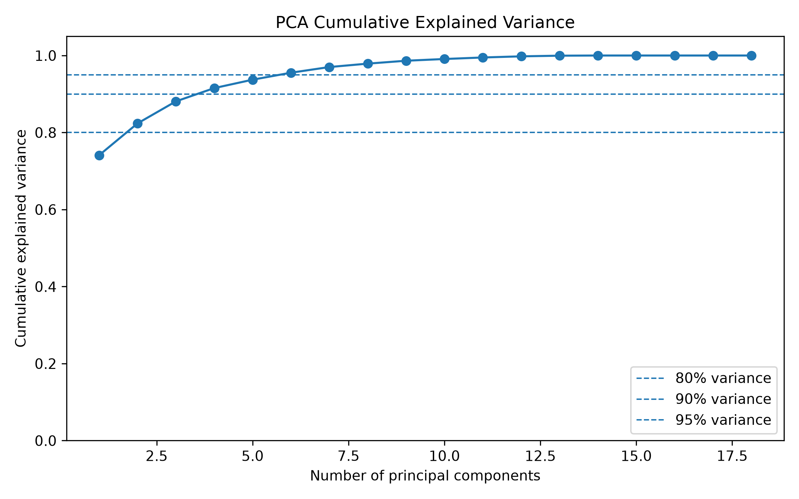

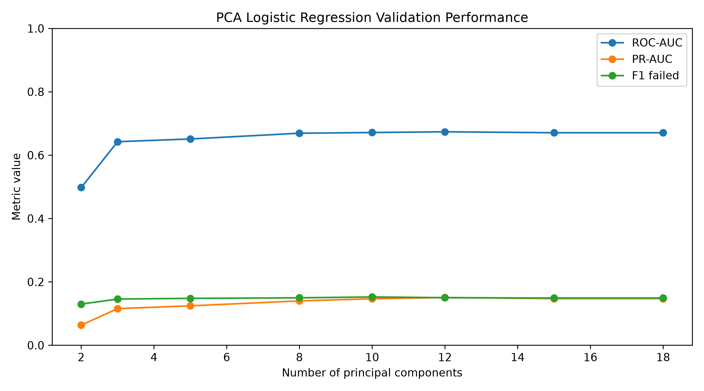

## Limitations

- Company-level splitting prevents direct firm overlap, but it is not a chronological backtest; train and test years overlap.
- Company-year rows are repeated observations, so they are not independent firm histories.
- The target and predictors are limited to the supplied dataset; reporting conventions, survivorship, sample composition, and label timing may matter.
- The models use financial statement levels and do not include macroeconomic, market, industry, governance, or qualitative information.
- Class imbalance leads to low precision and substantial false-positive burdens.
- Hyperparameter grids are limited, and the single split gives no confidence intervals or repeated-split uncertainty.
- Predicted probabilities are not presented as calibrated real-world bankruptcy probabilities.
- Coefficients, medians, and feature importances are predictive associations, not causal estimates.
- PCA reduces direct interpretability, and explained variance does not guarantee predictive usefulness.
- The project is an educational empirical study, **not a production-ready credit or investment system**.

## Repository structure

```text
data/raw/                 Raw American bankruptcy CSV (user supplied)
data/processed/           Pipeline-generated modeling and split datasets
src/bankruptcy_ml/        Validation, preprocessing, modeling, and evaluation logic
tasks/                    pytask workflow definitions
tests/                    pytest test suite
outputs/tables/           Generated summaries, metrics, predictions, and interpretations
outputs/figures/          Generated EDA, evaluation, threshold, and PCA figures
outputs/models/           Fitted joblib model artifacts
docs/                     Detailed project study guide
reports/oral_exam/        Concise speaking notes
reports/paper/             Expandable final-paper outline
```

## How to run the project

Place the source dataset at `data/raw/american_bankruptcy.csv`, then run:

```bash
pixi install
pixi run build
pixi run test
```

`pixi run build` executes the reproducible pipeline; `pixi run test` checks its core behavior. Existing generated results are versioned in `outputs/` for inspection.

## Portfolio note

This project demonstrates an end-to-end, tested Python workflow for an imbalanced financial classification problem: leakage-aware company grouping, interpretable and flexible models, validation-based selection, minority-class evaluation, threshold analysis, PCA, and cautious business interpretation. The central lesson is that bankruptcy screening is a decision problem with competing error costs—not an accuracy contest.
