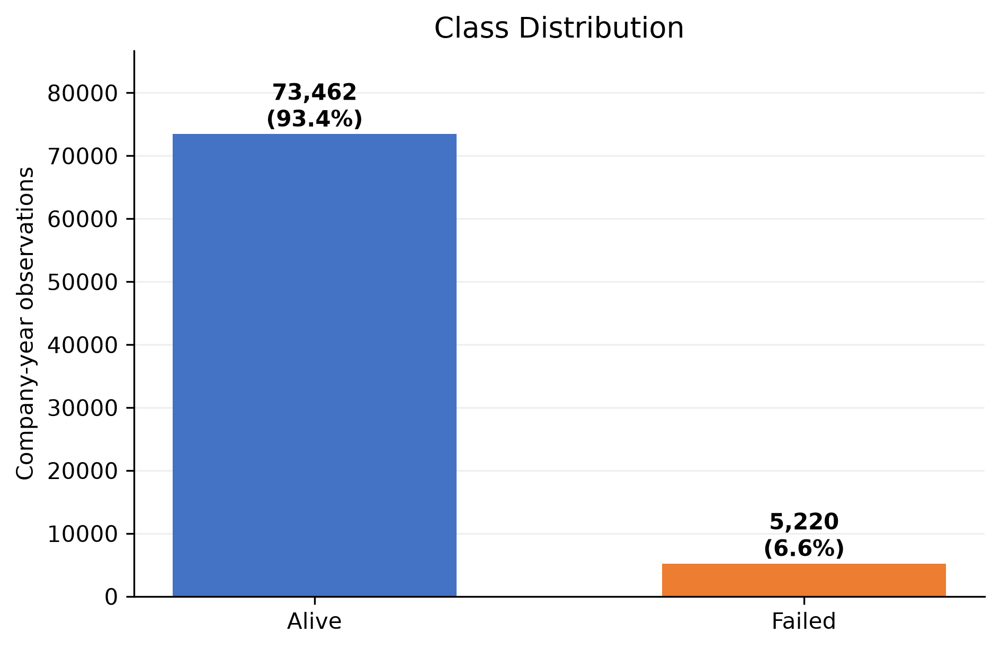
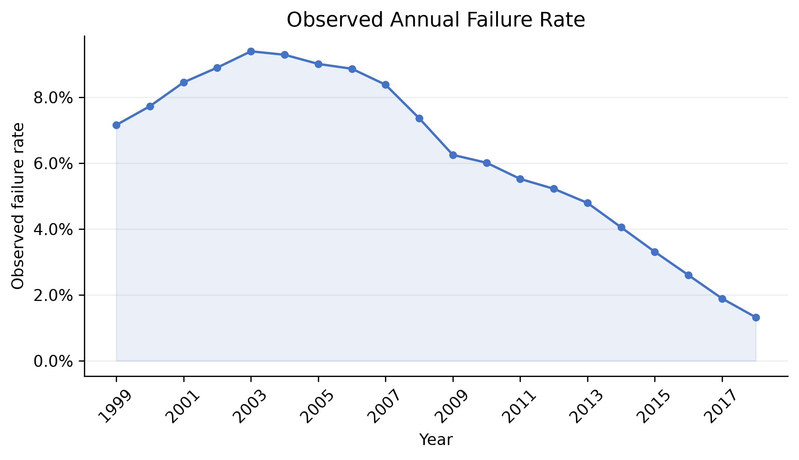
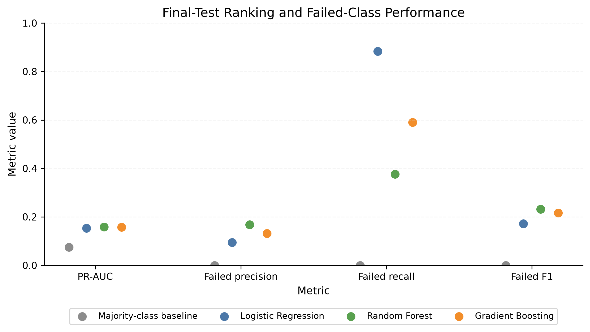
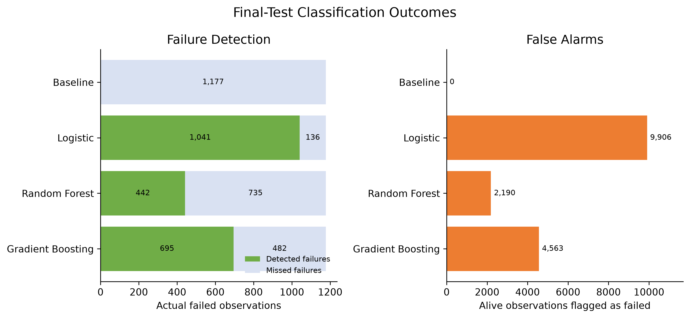
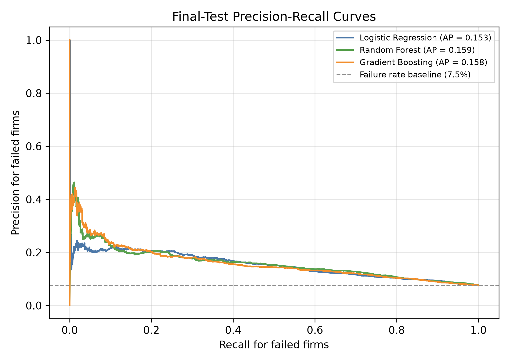
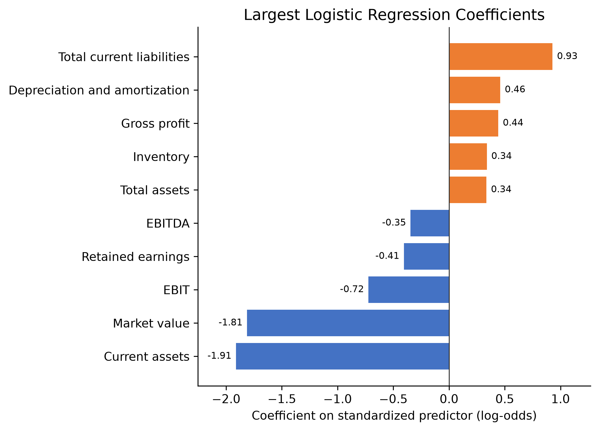

# Corporate Bankruptcy Prediction with Machine Learning

> A reproducible comparison of interpretable and tree-based classifiers for company-year bankruptcy-risk classification in an imbalanced dataset.

## Project Overview

This project classifies whether a company-year observation is labeled as failed or alive using financial-statement variables from an American companies bankruptcy dataset. Because bankruptcy is rare, a model can look accurate while still missing nearly every failed firm. For that reason, the project focuses on the failed class instead of only reporting overall accuracy.

The analysis compares a majority-class baseline, Logistic Regression, regularized Logistic Regression, Decision Tree, Random Forest, Gradient Boosting, and a PCA + Logistic Regression extension. The workflow is reproducible with Pixi, pytask, and pytest, and it produces the processed data, fitted models, metrics, tables, figures, and paper-ready outputs from the project pipeline.

## Research Question

How effectively can interpretable and tree-based machine-learning models distinguish failed from alive company-year observations for previously unseen companies, and what trade-offs arise between failure detection and false alarms?

## Key Methodological Decisions

- The data are company-year observations, with repeated observations for many firms.
- The train/test split is done at the company level so the same company does not appear in both sets.
- An internal validation split is used for model and hyperparameter selection.
- The final test set is used only for final evaluation.
- Class imbalance is handled through model design and by using appropriate failed-class metrics.
- Precision-recall area under the curve (PR-AUC) is the main ranking metric because failures are rare.
- Receiver operating characteristic area under the curve (ROC-AUC) is reported as a secondary threshold-independent ranking metric.
- Precision, recall, F1-score, predicted labels, and confusion outcomes depend on the operating threshold used for classification.
- Threshold analysis and PCA are included as course-related extensions.
- Predictions, tables, and figures are generated through a reproducible pytask pipeline.

## Models Evaluated

| Model | Role in the project |
|---|---|
| Majority-class baseline | Reference benchmark under class imbalance |
| Logistic Regression | Interpretable linear benchmark |
| L1 / L2 Logistic Regression | Regularized Logistic Regression variants |
| Decision Tree | Simple nonlinear model |
| Random Forest | Ensemble tree model |
| Gradient Boosting | Flexible boosted-tree model |
| PCA + Logistic Regression | Dimensionality-reduction extension |

## Main Results

Selected final-test results are shown below. PR-AUC and ROC-AUC evaluate ranking performance across thresholds. Precision, recall, and F1 are calculated for the failed class using the default 0.50 classification threshold.

| Model | PR-AUC | Failed precision | Failed recall | Failed F1 |
|---|---:|---:|---:|---:|
| Majority-class baseline | 0.075 | 0.000 | 0.000 | 0.000 |
| Logistic Regression | 0.153 | 0.095 | 0.884 | 0.172 |
| Random Forest | 0.159 | 0.168 | 0.376 | 0.232 |
| Gradient Boosting | 0.158 | 0.132 | 0.590 | 0.216 |

Gradient Boosting was selected ex ante based on validation PR-AUC. On the final test set, Random Forest produced a marginally higher observed PR-AUC and failed-class F1. This is reported as an ex post final-test observation, not as retrospective model selection.

Logistic Regression detects the largest share of failed firms, but it also creates many false alarms. Random Forest is more selective, while Gradient Boosting sits between the two. The differences in PR-AUC among the main predictive models are small, so the results should be interpreted as evidence of trade-offs rather than a single obvious winner.

## Selected Visual Results

The class distribution shows why accuracy alone is misleading: failed observations are a small minority of the data.



The annual failure-rate chart shows that observed failures vary over time. This is descriptive and should not be read as a causal claim.



The final-test performance summary compares ranking performance and failed-class operating metrics.



The classification-outcomes figure shows the practical screening trade-off: detected failures, missed failures, and false alarms.



The precision-recall curves are central to this project because the failed class is rare.



The Logistic Regression coefficient figure gives an interpretable view of conditional associations. Positive coefficients increase predicted failure scores; negative coefficients decrease them.



Additional supporting figures are available in `outputs/figures/`, `outputs/paper/figures/`, and the final paper appendix.

## Key Findings

- Class imbalance makes overall accuracy misleading.
- The majority-class baseline has high accuracy but detects no failed firms.
- Logistic Regression is interpretable and has high failed-class recall, partly because balanced class weighting gives failed observations more influence during fitting; at the default 0.50 rule, this also creates a large false-alarm burden.
- Random Forest provides the numerically highest observed final-test failed-class F1.
- Gradient Boosting was validation-selected and provides a balanced trade-off between recall and false alarms.
- PCA does not materially improve predictive performance and reduces direct interpretability.
- More flexible models do not clearly dominate the interpretable benchmark.

## Repository Structure

```text
corporate-bankruptcy-ml/
├── data/
│   ├── raw/                 # Original dataset
│   └── processed/           # Regenerated modelling datasets
├── src/bankruptcy_ml/       # Core analysis, modelling, and plotting code
├── tasks/                   # Reproducible pytask workflow
├── tests/                   # Automated pytest suite
├── outputs/
│   ├── tables/              # Generated analytical tables
│   ├── figures/             # Supporting figures
│   ├── paper/               # Curated paper tables and figures
│   ├── models/              # Locally generated fitted models
│   └── report/              # Data-validation report
├── reports/
│   └── paper/               # Final paper, code appendix, bibliography, and PDFs
├── pixi.toml                # Environment and runnable commands
├── pixi.lock                # Reproducible dependency lockfile
├── pyproject.toml           # Python project and lint/test configuration
├── pytask.py                # pytask configuration
└── README.md
```

Some artifacts are generated locally by the pipeline. In particular, processed datasets in `data/processed/` and fitted model binaries in `outputs/models/` can be regenerated with `pixi run build`. Selected tables, figures, and the paper PDF are kept in the repository for inspection.

## How to Reproduce the Project

Pixi is used to create the correct Python environment automatically. It installs the required Python version and packages from the lockfile, so no manual package installation is necessary.

### Core Prerequisites for the Analysis Pipeline

- Git
- Pixi
- a terminal

No separate Python installation is required if Pixi manages the environment. `pixi install` creates the Python environment and installs the Python packages recorded in `pixi.lock`. Install Pixi by following the official installation instructions for your operating system.

### Optional Prerequisite for Compiling the Paper

The data and modelling pipeline does not require LaTeX. If you also want to compile `reports/paper/main.tex`, you need a system-level LaTeX distribution that includes or supports `latexmk`. Pixi manages the Python environment, but it does not install this LaTeX distribution.

### Clone the Repository

```bash
git clone https://github.com/Berke-Pehli/corporate-bankruptcy-ml.git
cd corporate-bankruptcy-ml
```

### Install the Environment

```bash
pixi install
```

This creates the local environment and installs the exact dependency versions recorded in `pixi.lock`.

### Run the Full Pipeline

```bash
pixi run build
```

This command:

- validates the raw data;
- creates processed datasets;
- creates company-level train, validation, and test splits;
- trains the models;
- evaluates validation and final-test performance;
- creates threshold and PCA outputs;
- generates tables and figures;
- creates the paper-ready outputs.

### Run Tests

```bash
pixi run test
```

This runs the automated pytest suite and checks important project functions and output behavior.

### Run Linting

```bash
pixi run lint
```

This checks Python code quality and formatting with Ruff.

### Force a Full Rebuild

```bash
pixi run build --force
```

This reruns all pytask tasks even when existing outputs appear up to date. A normal `pixi run build` is usually sufficient.

### Compile the Paper

From the project root:

```bash
cd reports/paper
latexmk -pdf -interaction=nonstopmode -halt-on-error main.tex
```

This optional step requires a LaTeX distribution with `latexmk`. The compiled paper is available at `reports/paper/main.pdf`.

### Quick Reproduction Commands

```bash
git clone https://github.com/Berke-Pehli/corporate-bankruptcy-ml.git
cd corporate-bankruptcy-ml
pixi install
pixi run build
pixi run test
pixi run lint
```

## What Pixi and pytask Do

Pixi manages the Python environment. It reads `pixi.toml` and `pixi.lock`, installs the required packages, and runs project commands through `pixi run ...`.

pytask organizes the analysis as dependent tasks. It runs the steps needed to create the project outputs and skips tasks that are already up to date. `pixi run build --force` reruns everything.

## Generated Outputs

```text
outputs/tables/          Main analytical CSV tables
outputs/figures/         Supporting figures
outputs/paper/tables/    Curated paper tables
outputs/paper/figures/   Curated paper figures
outputs/models/          Locally generated fitted models
reports/paper/main.pdf   Final paper
```

Repeated builds are intended to be stable. Some generated files, especially processed data and model binaries, can be recreated locally from the pipeline.

## Limitations

- The company-level split prevents direct company overlap, but it is not a chronological backtest.
- The project uses one main split, so split-specific uncertainty remains.
- Although the predictive models outperform the failure-prevalence baseline, their absolute PR-AUC values remain modest, reflecting the difficulty of the rare-event prediction problem.
- Accounting-level variables may partly reflect firm size.
- Predictions are not causal effects.
- Model scores are not presented as calibrated real-world bankruptcy probabilities.
- Threshold choice depends on operational costs.
- The project is an educational empirical study, not a production-ready credit or investment system.

## Supporting Documents

- [Final paper](reports/paper/main.pdf)
- [LaTeX paper source](reports/paper/main.tex)
- [Code appendix](reports/paper/code_appendix.pdf)
- [Code appendix source](reports/paper/code_appendix.tex)

## Reproducibility Status

At the time of the final project cleanup:

- lint passes with `pixi run lint`;
- tests pass with `pixi run test`;
- the full pipeline runs with `pixi run build`;
- the paper compiles with `latexmk`;
- prediction CSV serialization is stable across repeated forced builds.

## License

This project is licensed under the MIT License. See the [LICENSE](LICENSE) file for details.

## Contributing

Contributions are welcome. A sensible workflow is:

1. Fork the repository.
2. Create a feature branch.
3. Add or update tests.
4. Submit a pull request.

## Author

Berke Pehlivan  
Econometrics MSc — University of Bonn  
Data Analytics | SQL | Python | Power BI | Econometrics | Statistics

- GitHub: [Berke-Pehli](https://github.com/Berke-Pehli)

This project is part of my portfolio work in analytics, experimentation, SQL, Python, and Power BI.

Questions? Open an issue on GitHub or contact the author directly.
